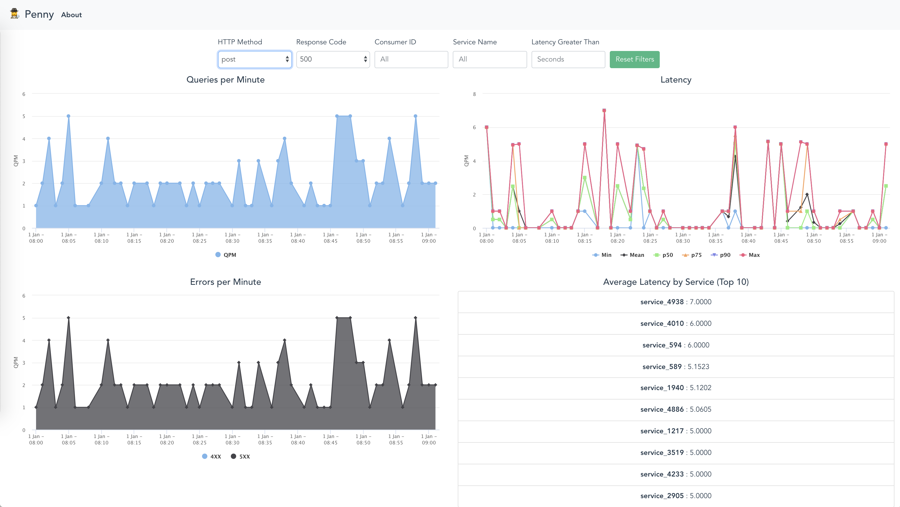

# 🕵️‍♀️ penny

🕵️‍♀️ Penny is your friendly neighborhood HTTP traffic inspector app.



## Features

* Comprehensive dashboard with multiple filters
* Zoomable metrics to help triage traffic irregularities
* Sharable URLs to get your team on the same page
* Service-level statistics to find bottlenecks

### Dashboard Components

* **Queries per Minute**: Track network throughput over time
* **Latency Statistics per Minute**: Statistical overview of latency
* **Errors per Minute**: View spikes in 4xx and 5xx errors
* **Average Latency by Service**: Identify potentially overloaded services

### User Journey

Penny enables developers and site reliability engineers to view a comprehensive dashboard of their network's HTTP traffic health, both at a high-level glance and with detailed precision.

As a result, Penny is often displayed on large monitors in offices as part of a "control center" stack for site health and network availability. However, with its interactive zoomable graphs and sharable URL filters, Penny is optimized for active data exploration and collaboration with teammates.

Engineers with site reliability responsibilities use Penny to track and triage network latency, error rates, bottlenecks, and throughput, both at an overall network level as well as a service level.

When an irregularity is observed (such as spike in error rates), an engineer can zoom into that region of the chart to provide more precision into which service might be having an issue. Once the service(s) have been identified, the engineer will be able to devise a plan to fix the root case of the network issues (such as rolling back a recent release or restarting a given service).

To the extent an individual engineer requires additional help, they can share the current URL with their colleagues, and Penny will use the URL query parameters to bootstrap its filtered view to exact the same view as the original on-call engineer.

### Current Implementation Tradeoffs

Penny is a demonstration app, built with Vue.js and Highcharts, over the course of a few hours.

Most notably, Penny is not currently set up for real-time monitoring (which is its ultimate purpose). With more time, Penny can be modified to connect to a back-end server that will provide real-time network traffic data. At the moment, the Penny demo app is only looking at shorter time range of sample traffic data. This tradeoff was made in the interest of focusing on the features and functionalities of the core Penny dashboard.

Additionally, this back-end server should perform more of the data processing that is currently happening on the front-end (e.g. grouping traffic by service or by the minute). This will lighten the load on the front-end computation required to drive the Penny charting dashboard.

Another suggested next step with more time is to further break down some of the frontend Vue components into even smaller reusable components (e.g. create a reusable `Graph` component that wraps the Highcharts component that comes with standard chart config that can be overwritten and modified).

## Project setup

To run Penny locally, install and run the development mode:

```
npm install
npm run serve
```

Penny will be available locally at `http://localhost:8080/` in your web browser.

## More details and instructions

### Install dependencies
```
npm install
```

### Compiles and hot-reloads for development
```
npm run serve
```

### Compiles and minifies for production
```
npm run build
```

### Lints and fixes files
```
npm run lint
```

### Run your unit tests
```
npm run test:unit
```

### Data exploration utilities

Convert CSV to JSON:

```
../node_modules/csvtojson/bin/csvtojson traffic.csv > converted.json
```

Explore the data (group and view by parameter):
```
python ./scripts/summarize.py
```

